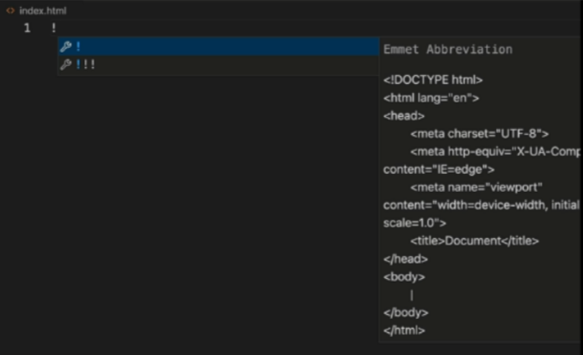

# Setting Colors

In CSS, a rule consists of a "property" and a "value". The property determines what you want to change, and the value specifies the new setting. When working with colors, there are two primary properties:

color: Sets the color of the text.

```HTML
<!-- HTML -->

```

```CSS
/* CSS */
background-color: Sets the background color of an HTML element.
}
```

This applies the rule to the `<body>` element, which contains all the content on the page.

# Color Formats

There are different ways to define colors in CSS. The two main methods are named colors and hex codes.

Named Colors

Named colors are a simple way to use color by just typing its name. There are many named colors available, from basic colors like "red" and "blue" to more descriptive ones like "cornflowerblue" and "olivedrab".

How to use: Simply use the name of the color as the value for a color property.

```HTML
<!-- HTML -->
example
```

```CSS
/* CSS */
h1 {
  color: dimgrey;
}
```

## Using hex codes for colors

You may sometimes want to have a more unique color palette, like going to colorhunt.co. In that case you can use the hex code number.



How to use: You use a # symbol followed by the six-digit hex code.

```HTML
<!-- HTML -->

```

```CSS
/* CSS */
h2 {
  color: #5d3891;
}
}
```
This hex code corresponds to a specific shade of purple. Many online tools, like Color Hunt, provide professionally designed color palettes and their corresponding hex codes, making it easy to find and use unique color combinations for your website.