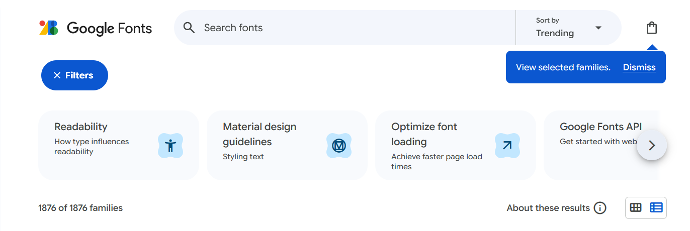
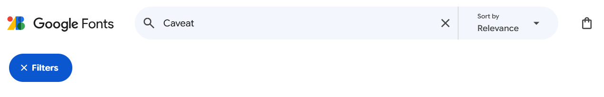
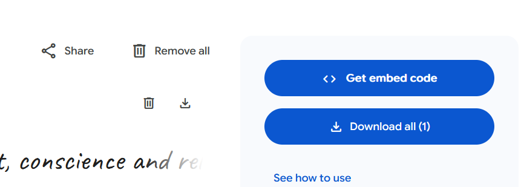
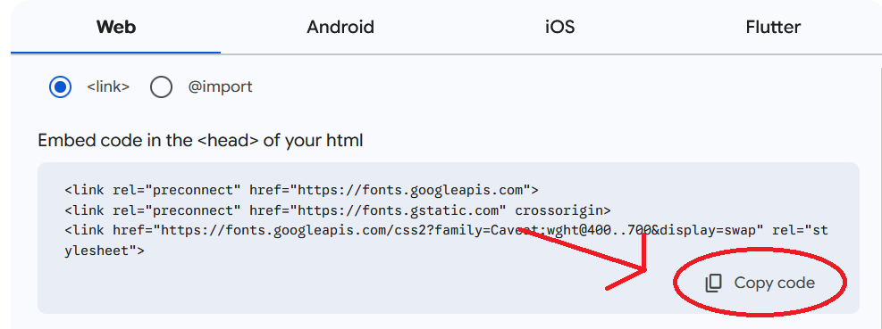

# Font properties

## Key CSS Font Properties

Here are some of the most important properties for styling fonts:

- color: Sets the color of the text.
- font-size: Changes the size of the text.
- font-weight: Makes the text bolder or lighter.
- font-family: Specifies the typeface (the actual font) to be used.
- text-align: Controls the horizontal alignment of the text (e.g., left, right, or center).

## Understanding Font Sizing

Font sizes can be set using different units. Choosing the right unit is crucial for making your website responsive and accessible.

### Absolute Units

Absolute units are fixed and do not change regardless of other elements on the page.

Pixels (px): A pixel is a tiny dot on a screen. One pixel is about 1/96th of an inch (0.26mm). Using pixels gives you precise control over font size, but it can make your text difficult to read on different screen sizes or when a user zooms in or out.

Points (pt): A point is a unit traditionally used in print design. One point is 1/72nd of an inch (0.35mm). Points are a bit larger than pixels and are often used to make web content look consistent with a printed version.


### Relative Units

Relative units scale based on the size of other elements, making your website more flexible and responsive.

em: Pronounced "em" (like the letter 'm'), this unit is relative to the font size of its parent element. For example, if a parent element has a font size of 20px, an h1 element inside it with a font size of 2em would be 2 * 20px, or 40px. The size of an em can change if its parent's size changes, which can sometimes be confusing.

rem: The "r" stands for "root". This unit is relative to the font size of the root HTML element (<html>). This means its size is consistent and doesn't depend on a parent element. Using rem is a recommended practice because it provides more predictable sizing and makes it easier to manage font sizes across your entire website.

### Choosing and Using a Font

The "font-family" property determines the typeface. When choosing a font, you should always include a fallback option.

Font Stacks: It is best practice to list several font names separated by commas. The browser will try to use the first font in the list; if that font isn't available on the user's computer, it will move to the next one.

Generic Font Families: Always end your list with a generic font family like serif, sans-serif, or monospace. These are broad categories of fonts that ensure the browser will display something similar to what you intended.

Serif fonts have small decorative lines or "feet" at the end of their strokes.

Sans-serif fonts do not have these decorative lines and are known for their clean, modern look.

### Custom fonts from Google

Custom Fonts (Google Fonts): If you want to use a font that might not be on a user's computer, you can link to a font service like Google Fonts. This ensures that everyone who visits your website sees the same custom font.
<br><br>


To use a Google Font, you must:

Add a `<link>` tag in the `<head>` section of your HTML file that points to the font's location on Google's servers.

- Go to Google fonts 
- https://fonts.google.com/
- Type the font name on the search bar
 

- Click on the font name
- Scroll down and choose the font weight 
- Click the "Get font" button
- Now click on the "Get embed code"


- Make sure the link option is checked and click on "Copy code"



- Then paste it to your file, inside the head element, just after the style tag

 ```HTML
<!-- HTML -->
    }
  </style>
  <link rel="preconnect" href="https://fonts.googleapis.com">
  <link rel="preconnect" href="https://fonts.gstatic.com" crossorigin>
  <link href="https://fonts.googleapis.com/css2?family=Caveat&display=swap" rel="stylesheet">
</head>
```

Use the font's name in your CSS font-family property. If the font name has multiple words (like "Times New Roman"), be sure to put it in quotation marks.
```CSS
/* CSS */
/* Link: https://fonts.google.com/ specimen/Caveat */
    #family {
      font-family: 'Caveat', cursive;
    }
```


