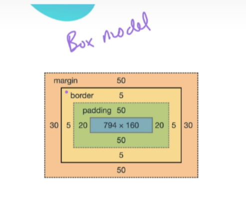
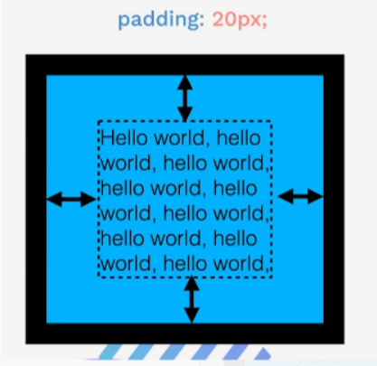
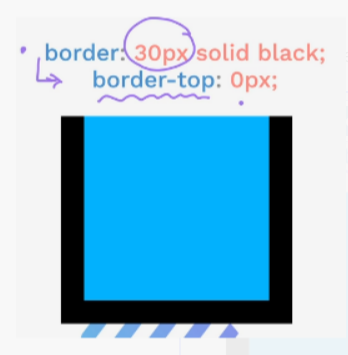
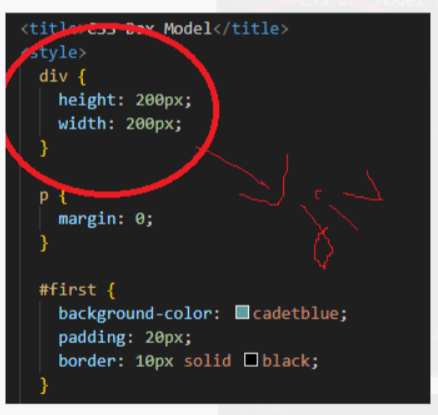
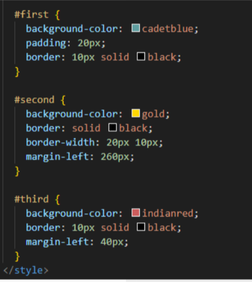
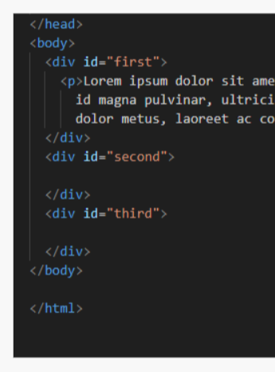
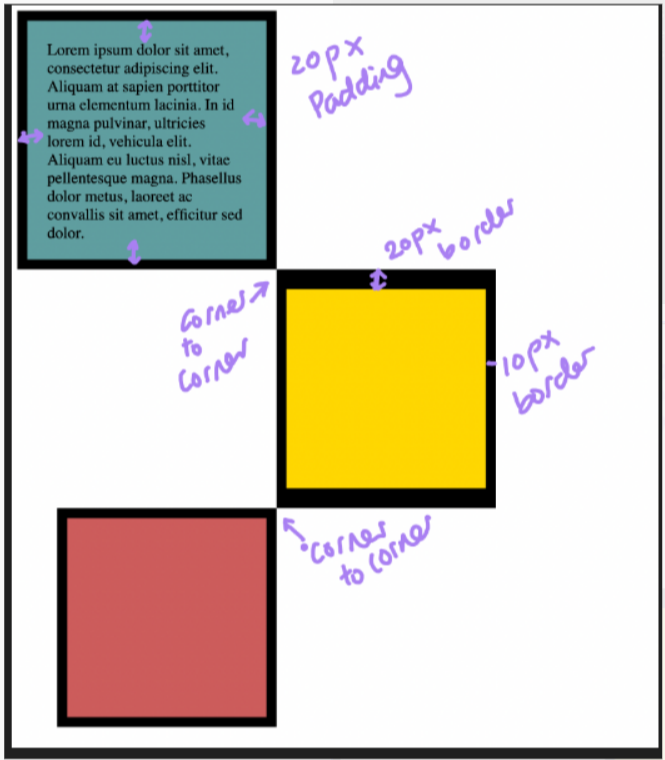

# Box model

 If you think about a typical website, you've got different components that are on screen, different HTML elements. Even though we can't really see it, each element is effectively a box in itself. We can change the dimensions of those boxes by changing things such as width and height.


## The box model consists of four primary components, working from the inside out:



### 1 Content

This is the innermost part of the box, containing the actual content of the HTML element, such as text, images, or other elements. You can control its size using the width and height properties.

- width and height: These properties set the dimensions of the content area. They can be defined using pixels (px), percentages (%), or other units.

- Pixels (px): Provide a fixed size that doesn't change with the viewport size.

- Percentages (%): Provide a flexible size that adjusts based on the size of the containing element.

### 2 Padding

Padding is the transparent space directly surrounding the content. It acts as a buffer between the content and the border, pushing the border and any content outside the element away from the content within the element.



- Property: Use the padding property to set the padding on all four sides. You can also specify padding for individual sides: padding-top, padding-right, padding-bottom, and padding-left.

Shorthand: The padding property can take multiple values:

- One value (e.g., padding: 20px;): Applies the same padding to all four sides.

- Two values (e.g., padding: 10px 20px;): The first value applies to the top and bottom; the second applies to the left and right.

- Four values (e.g., padding: 5px 10px 15px 20px;): Applies padding to the top, right, bottom, and left, respectively, in a clockwise direction.

### 3 Border

The border is a line that frames the padding and content. It's a key part of the box model, as it visually separates an element from its surroundings.



Property: The border property is a shorthand for three separate properties: border-width, border-style, and border-color.

- border-width: The thickness of the border (e.g., 10px). This property can also take multiple values, just like padding.

- border-style: The style of the border line (e.g., solid, dashed, dotted, none).

- border-color: The color of the border.

```CSS
/* CSS */
.my-box {
  border: 10px solid black;
}
```

This code creates a 10px thick, solid black border around the element with the class .my-box.

Individual Border Sides: You can target specific sides of the border using properties like border-top, border-right, border-bottom, and border-left. For example, border-top-width: 0px; would remove the top border.


### 4 Margin

Margin is the transparent space outside the border. It's used to create distance between an element and other elements on the page. Unlike padding, margin does not affect the element's background color.


Property: Use the "margin" property to set the margin on all four sides. Like padding and border-width, it supports one, two, or four values.

Example: If two elements each have a "margin-bottom: 10px;" and "margin-top: 10px;", the total vertical space between them will be 20px.

Shorthand: The margin property works exactly like the padding property for applying values to different sides.

- One value (e.g., margin: 10px;): Applies the same margin to all four sides.

- Two values (e.g., margin: 5px 15px;): Applies the first value to the top and bottom, and the second to the left and right.

- Four values (e.g., margin: 10px 20px 30px 40px;): Applies margin to the top, right, bottom, and left, respectively, in a clockwise direction

## Using divs for Layout

The `<div>` element, or "Content Division Element," is a generic, block-level HTML element that has no inherent visual styling. Its main purpose is to serve as a container for grouping other HTML elements. By wrapping content in a "div", you can apply CSS rules to the entire group at once.


- Invisible by Default: A div is invisible on its own. It only becomes visible when you apply styles like a border, background color, padding, or margin.

- Example HTML:

```HTML
<!-- HTML -->
<body>
  <div class="card">
    <h2>My Box Model</h2>
    <p>This is some text inside a div.</p>
  </div>
  <div class="another-card">
    
  </div>
</body>
```

```CSS
/* CSS */

```
Purpose: divs are essential for creating complex layouts. They allow you to apply the box model to a collection of elements, making it easier to control their positioning and spacing relative to other parts of the webpage.

### Invisible div

There's no point learning about the `<div></div>` before you learn about CSS because these are completely invisible unless you apply CSS Style to it.
Its purpose is to act like an invisible box that can contain elements

<br>




<br>




<br>




<br>

