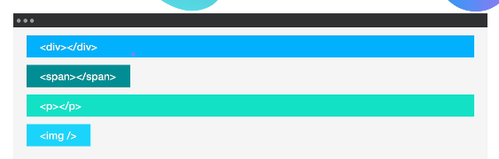

# CSS Display

The CSS display property is fundamental for controlling the layout of web elements on a page. It determines how an element is rendered and how it interacts with other elements. Understanding the different display values is crucial for building well-structured and responsive websites.



There are three common display values you'll encounter as a beginner: block, inline, and inline-block. 


CSS Display Property Explained for Beginners
The CSS display property is fundamental for controlling the layout of web elements on a page. It determines how an element is rendered and how it interacts with other elements. Understanding the different display values is crucial for building well-structured and responsive websites.

There are three common display values you'll encounter as a beginner: block, inline, and inline-block. Let's explore each one.

## 1 display: block

By default, many HTML elements, such as `<p>`, `<h1>`, `<div>`, and `<h2>`, are block-level elements. This means:

They take up the full available width of their container. Think of them as a "block" that extends from the left to the right of the page.

They always start on a new line. Any element that follows a block-level element will appear on the next line, not next to it.

You can set their height and width. Unlike inline elements, you have complete control over their dimensions.

Example:

The two paragraphs below are block-level elements. Even though the first paragraph is short, the second one still starts on a new line because the first one takes up the full width.

```HTML
<!-- HTML -->
<p>This is a short paragraph.</p>
<p>This is another paragraph that will appear on a new line.</p>
```

## 2 display: inline

Inline elements, such as `<span>`, `<a>`, `<strong>`, and `<em>`, are meant to be used within a line of text. This means:

They only take up as much width as their content requires. They don't stretch to fill the entire line.

They do not start on a new line. They sit side-by-side with other inline or inline-block elements.

You cannot set their width or height. Their dimensions are determined solely by the content inside them.

A `<span>` tag is often used to apply a specific style to a small portion of text within a larger element, like a paragraph.

Example:

In the following code, the word "beautiful" is wrapped in a `<span>` tag. Even with the `<span>` tag, the text "Hello, beautiful world." appears on a single line.

```HTML
<!-- HTML -->
<p>Hello, <span>beautiful</span> world.</p>
```

## 3 display: inline-block

The inline-block value offers a hybrid of the inline and block properties. It's perfect for situations where you want elements to behave like both.

They sit on the same line. Like inline elements, they appear horizontally next to each other.

You can set their width and height. Like block elements, you can control their dimensions.

They can wrap to a new line. If there isn't enough horizontal space, they will move to the next line.

This property is extremely useful for creating layouts with multiple columns of elements, such as image galleries or navigation menus, where you want elements to be both size-controllable and align horizontally.

## The display: none Value 

In addition to the three main values, the display: none value is a powerful tool. When you set an element's display property to none, it completely removes the element from the page. It's not just hidden; it's as if the element never existed in the HTML. This is often used for:

Hiding/showing content based on user interactions, like clicking a button to hide a pop-up window or a "to-do list" item.

Conditionally displaying elements that you don't want to show on a web page at a given moment.

## Code Challenge 

To solidify your understanding, let's try a simple challenge.

Your goal is to manipulate the display property to achieve two different layouts.

Starting HTML:

Imagine you have a single HTML file with three identical `<div>` elements styled as squares.

```HTML
<!-- HTML -->
<style>
    div {
        height: 200px;
        width: 200px;
        border: 1px solid black;
        margin: 5px;
    }

    #red-box {
        background-color: red;
    }

    #green-box {
        background-color: green;
    }

    #blue-box {
        background-color: blue;
    }
</style>

<div id="red-box"></div>
<div id="green-box"></div>
<div id="blue-box"></div>
```

### Challenge 1: Horizontal Layout

Modify the CSS to make the three squares line up horizontally.

Hint: Think about which display value allows elements to sit on the same line and also respects their defined height and width.

```CSS
/* CSS */
/* SOLUTION 1 */
div {
    display: inline-block;
    height: 200px;
    width: 200px;
    border: 1px solid black;
    margin: 5px;
}
```

By changing the display property to inline-block, all three boxes will line up horizontally as long as there is enough room on the page.

### Challenge 2: Vertical Layout

Now, change the code to make the squares stack vertically on top of each other.

Hint: Think about which display value forces each element to start on a new line.

```CSS
/* CSS */
/* SOLUTION 2 */
div {
    display: block;
    height: 200px;
    width: 200px;
    border: 1px solid black;
    margin: 5px;
}
```

By setting the display property to block, each <div> will take up the full width, forcing the next one to a new line, thus creating a vertical stack.