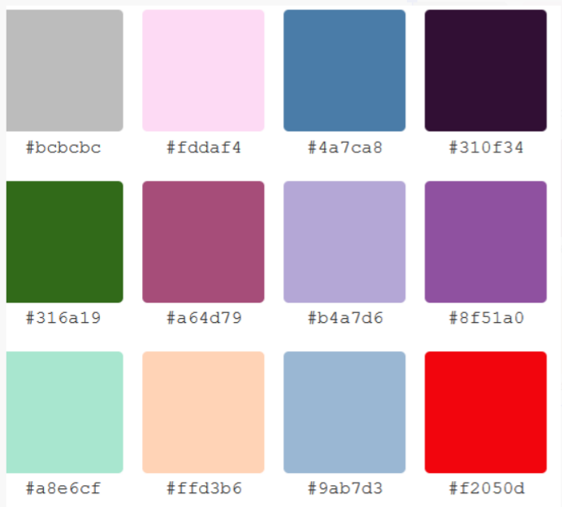

# Boilerplate Shortcut --> !

- Most IDEs and text editors have built-in features, extensions, or snippets to help you generate boilerplate code quickly.
- In VSCode, typing ! followed by Tab or Enter in an HTML file will generate the basic HTML5 document structure. This is often the most well-known boilerplate shortcut
- 