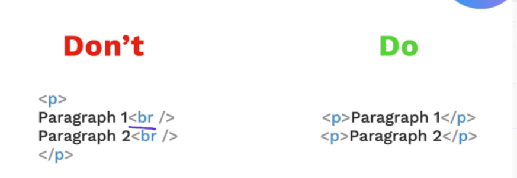

# Size of Heading from 1 to 6
From 1 to 6
```HTML
<h1>Heading</h1>
<h2>Heading</h2>
<h3>Heading</h3>
<h4>Heading</h4>
<h5>Heading</h5>
<h6>Heading</h6>
```

# Element
Element is everything from one tag to another
```HTML
<h1>Hello World</h1>
```

# Paragraph element

A paragraph element, denoted by the `<p>` tag in HTML, is a block-level element used to represent a paragraph of text. It's one of the most fundamental elements for structuring content on a web page. The `<p>` element automatically adds a blank line before and after the text it contains, visually separating it from other elements.
```HTML
  <p> Paragraph element </p>
```

# Void elements
Void elements in HTML are elements that don't have a closing tag and cannot contain any content. They are also sometimes called "self-closing" or "empty" elements.

Because they can't contain content, they also don't have a closing tag like `</br>` or `</img>`. While in XHTML it was mandatory to add a trailing slash (e.g., `<br />`), in HTML5 this is optional and most developers omit it.

Here are some of the most frequently used void elements:

`<br>`: Inserts a line break, forcing the text to the next line. This is a common way to format things like addresses or poetry where you need line breaks without starting a new paragraph.

`<hr>`: Creates a horizontal rule, which is a visual line used to separate sections of content.

``: Embeds an image into the document. It requires the src attribute to specify the image file's location.

`<input>`: Creates an interactive control for web-based forms, such as a text field, checkbox, or button. It uses the type attribute to define the kind of input it is.

`<link>`: Defines a link between the current document and an external resource, most commonly used to link to an external stylesheet (<link rel="stylesheet" href="style.css">).

`<meta>`: Provides metadata about the HTML document, such as character set (<meta charset="UTF-8">) or description for search engines.




# Unordered list
```HTML
  <ul>
  <li>Milk</li>
  <li>Eggs</li>
  <li>Flour</li>
</ul>
```

# Ordered list

```HTML
<ol>
  <li>Milk</li>
  <li>Eggs</li>
  <li>Flour</li>
</ol>
```

# Nesting
Nesting is the practice of placing one or more HTML elements inside another. This creates a parent-child relationship between elements, forming the hierarchical structure of a web page. The inner element is considered the "child" of the outer "parent" element.
```HTML
<ul>
  <li>Wake up and stretch</li>
  <li>Drink a cup of coffee</li>
  <li>Plan the day's tasks</li>
  <li>Eat breakfast
    <ul>
      <li>Make oatmeal</li>
      <li>Add berries and nuts</li>
      <li>Enjoy with a glass of juice</li>
    </ul>
  </li>
  <li>Start the first task</li>
  <li>Take a short break</li>
</ul>
```

# Anchor elements
Anchor elements, or `<a>` tags, are used to create hyperlinks that link one web page to another. They're essential for navigation and form the backbone of the web.

`<a> text </a>`

An anchor element has a starting tag `<a` and an ending tag `</a>`, with the text or image you want to be clickable in between. 
    
The magic happens with the href attribute. This attribute specifies the URL (web address) that the link goes to.

`<a href=??????????> text </a>`

Example:

```HTML
<a href="https://www.google.com">Go to Google</a>
```

# Image elements
An image element, specified by the `` tag, is used to embed an image into an HTML page. It's a void element, meaning it doesn't have a closing tag and cannot contain content. The most important attribute for an image element is src, which stands for source. This attribute points to the location of the image file, either a URL on the web or a file path on your server.

The alt attribute (short for alternative text) provides a text description of the image. This attribute is crucial for web accessibility and is a best practice for all images.

```HTML
<!DOCTYPE html>
<html>
<head>
    <title>Image Example</title>
</head>
<body>

    <h1>A Picture of a Lighthouse</h1>

    

</body>
</html>
```


