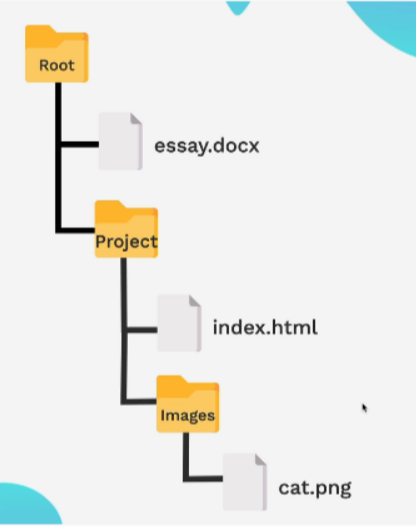
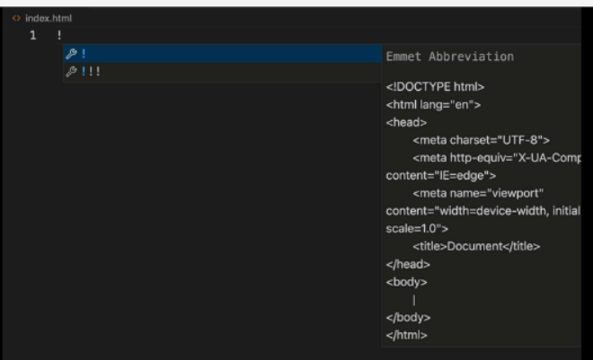

# File paths

File paths are like addresses for files and folders on a computer. They tell the browser or operating system exactly where to find a specific file. There are two types: absolute paths and relative paths.

# Absolute Paths

An absolute path is the complete, full address of a file, starting from the root of the file system. It's like giving someone a full street address, including the city, state, and zip code. This path will work from any location on the computer.

Example (Windows): C:\Users\John\Documents\essay.docx

In web development, an absolute path is a full URL, such as https://www.example.com/images/logo.png.

Relative Paths

A relative path specifies a file's location in relation to the current file. This is a common practice in web development because it's more flexible. It's like giving directions from your current location, such as "turn left at the next street."

Here are a few examples based on the folder structure in the image above and the location of the index.html file:

To access cat.png you would go into the Images folder.

        Path: Images/cat.png

To access essay.docx you would go up one level to the Root folder. The .. symbol is used to move up one directory.

        Path: ../essay.docx

# The boilerplate

The boilerplate in HTML refers to the basic, required code structure that every HTML page should have to be considered a valid document. It's the starting template that sets up the foundation for all other content.

Most code editors like VS Code have built-in shortcuts to quickly generate this boilerplate. As shown in image below, typing ! and pressing Enter will automatically generate this basic HTML structure for you.

