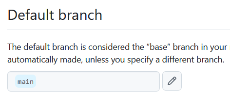
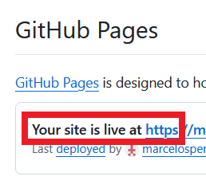

# Hosting a web site on Github

On Github:
- Create new repository
- Name : html-portfolio
- public
- add a README file
- click create repository

# Upload files to html-portfolio
- Click on ADD FILE dropdown button on html-portfolio to upload your files
- 
- You must have the INDEX.HTML or else GitHub won't work
- Select all files and drag with mouse inside GitHub (drag one folder at a time)
- Click on commit changes
- Now go to Settings \ pages
- Change Branch from None to Main
- 
- Hit save
- Refresh page until it says SITE IS LIVE AT, it may take a while to take effect
- 
- Now just click on visit site